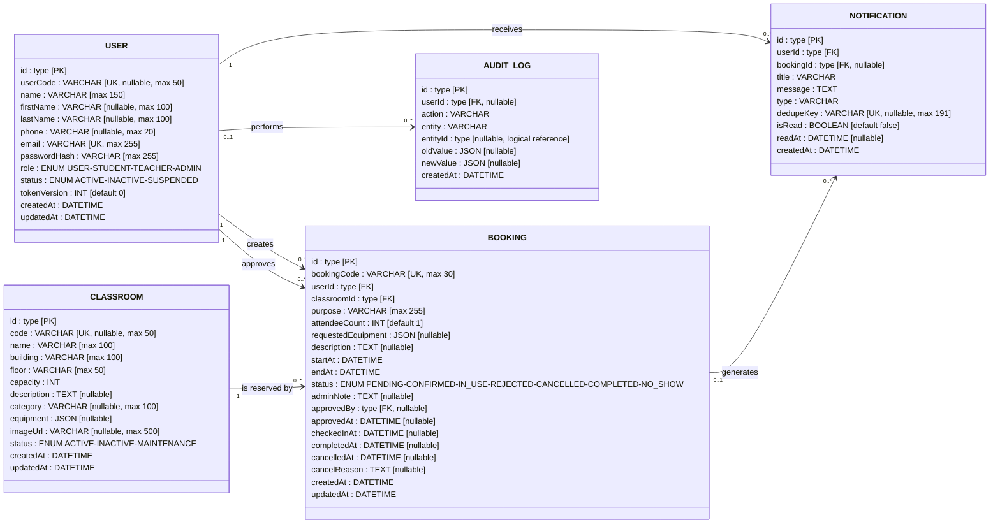

# Database Entity Relationship Diagram

แผนภาพนี้อ้างอิงจาก `prisma/schema.prisma` และ migration ปัจจุบันของฐานข้อมูล MySQL

ไฟล์สำหรับแก้ไขใน diagrams.net: [`db-erd.drawio`](./db-erd.drawio)

## Foreign keys

- `Booking.userId` → `User.id` (`ON DELETE RESTRICT`)
- `Booking.classroomId` → `Classroom.id` (`ON DELETE RESTRICT`)
- `Booking.approvedBy` → `User.id` (`ON DELETE SET NULL`)
- `Notification.userId` → `User.id` (`ON DELETE CASCADE`)
- `Notification.bookingId` → `Booking.id` (`ON DELETE SET NULL`)
- `AuditLog.userId` → `User.id` (`ON DELETE SET NULL`)

`AuditLog.entityId` เป็น polymorphic/logical reference ที่ใช้ร่วมกับ `entity` จึงไม่ได้ประกาศเป็น foreign key โดยตรง

## Main indexes

- `Booking`: `userId`, `classroomId`, `status`, `startAt`, `endAt`
- `Booking`: composite index (`classroomId`, `startAt`, `endAt`, `status`)
- `Notification`: `userId`, `bookingId`, `isRead`
- `AuditLog`: `userId`
